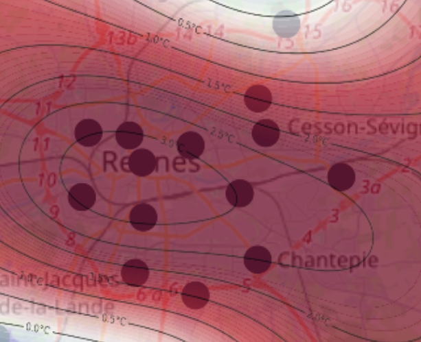

# ICU Rennes – Dynamic Urban Heat Visualization (2018)

This repository hosts a minimal but functional prototype exploring urban heat island dynamics in Rennes (France) using temperature measurements from a subset of stations available for the year 2018.

The application allows:
- visualization of raw temperature measurements at each station,
- computation of ICU values (Urban Heat Island intensity),
- spatial interpolation to obtain continuous maps across the city,
- temporal exploration over a full day and on selected hot days,
- generation of average day/night ICU maps for identifying persistent hotspots.

All methodological details, assumptions, data choices, and limitations are documented directly within the Streamlit application.

**Live application:**  
https://icu-rennes-visualization.streamlit.app/

Feedback or suggestions for improvement are welcome! :wink:
